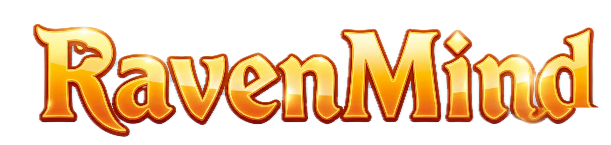

  

  <b>The Three-Eyed Raven Sees All. Can You Outsmart It?</b> 
  A thrilling Game of Thrones character guessing game powered by a custom Akinator-style intelligence.

  <a href="#the-experience">The Experience</a> •
  <a href="#demo">Demo</a> •
  <a href="#how-to-play">How to Play</a> •
  <a href="#the-mind-of-the-raven">Behind the Magic</a> •
  <a href="#join-the-realm">Join the Realm</a>

---

## 🦅 The Experience

Step into Westeros. **RavenMind** is an immersive, interactive experience designed to test the limits of the Three-Eyed Raven's knowledge. Think of any notable character from the *Game of Thrones* universe, answer a series of cryptic "Yes/No" questions, and watch as the Raven narrows down its visions to reveal exactly who you are thinking of.

It features a premium Game of Thrones aesthetic—complete with dark coal backgrounds, blood-red themes, antique gold glowing accents, and an interactive background with floating fire embers that pull you right into the Long Night.

## 🎥 Demo

*(A vision of the future... demo video coming soon!)*

## ✨ Features

- **Uncanny Accuracy**: A custom probabilistic engine that filters down character candidates based on their deepest secrets, traits, and alliances.
- **Westerosi Aesthetic**: High-quality, responsive UI with custom textures, glowing elements, and carefully selected typography.
- **Immersive Animations**: Smooth screen transitions and an animated ember background bring the game to life.
- **Rich Lore Database**: Detailed profiles, traits, and high-resolution images of your favorite (or most hated) figures from the Seven Kingdoms.

## 🎮 How to Play

1. **Choose Your Champion (or Villain)**: Think of a character from the *Game of Thrones* universe (e.g., Jon Snow, Cersei Lannister, The Hound).
2. **Face the Raven**: The Three-Eyed Raven will probe your mind with questions. Answer truthfully: *Yes, No, Don't Know, Probably,* or *Probably Not*.
3. **The Vision**: Once the Raven's visions are clear, it will reveal its guess.
4. **Judge the Outcome**: Confirm if the Raven saw the truth, or if you managed to keep your secrets hidden.

## 🧠 Behind the Magic

RavenMind isn't just magic; it's math. The core uses a custom intelligence engine that evaluates characters using a confidence score system based on information theory. 

By calculating the *entropy* (information gain) of each available question, the Raven always asks the exact question needed to split the remaining candidates most evenly, dynamically adjusting its possibilities with every answer you give until only one truth remains.

## 🤝 Join the Realm

The Seven Kingdoms are vast, and our roster is always expanding. We welcome Maesters and builders to contribute to the realm!

Whether you want to add obscure characters from the books, refine the Raven's questioning logic, or forge new UI elements:

- **Expand the Lore**: Add new characters and their unique traits.
- **Sharpen the Mind**: Help optimize the Raven's entropy calculations.
- **Enhance the Vision**: Suggest or build new immersive visual features.

Ready to swear your oath? Fork the realm, make your mark, and send a Raven (open a Pull Request)!
